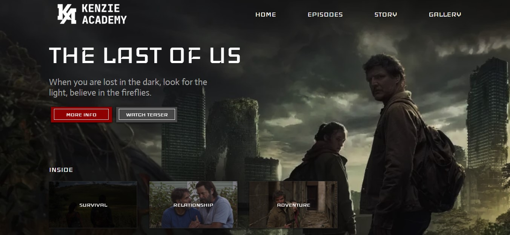
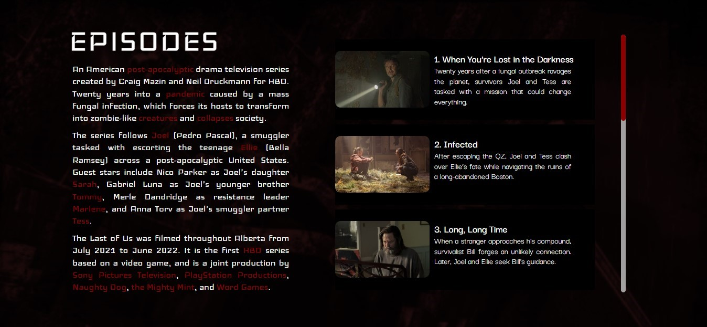
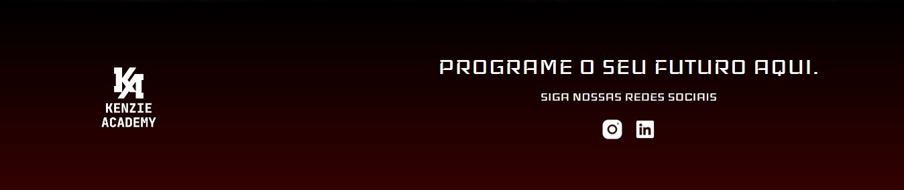

<h1 align="center"> The Last Of Us </h1>

Projeto realizado durante a Maratona de Programação da Kenzie Academy.

  
  
  

---

## 🚀 Tecnologias

Esse projeto foi desenvolvido com as seguintes tecnologias:

- HTML e CSS
- JavaScript
- Figma

---

## 💻 Projeto

Projeto desenvolvido durante a Maratona de Programação da Kenzie Academy, sobre a série da HBO "The Last Of Us".

---

## 🔖 Layout

Você pode visualizar o layout do projeto através [DESSE LINK](https://www.figma.com/file/B5DUt8yLLKgRscC9JA2BMl/Maratona-Kenzie---The-Last-of-Us?node-id=0%3A1). É necessário ter conta no [Figma](https://figma.com) para acessá-lo.